# Cosmos Policy 论文详解：把视频生成模型改造成机器人策略

> 原文：Moo Jin Kim et al., **Cosmos Policy: Fine-Tuning Video Models for Visuomotor Control and Planning**, arXiv:2601.16163, 2026-01-22  
> 本地 PDF：[cosmos_policy.pdf](cosmos_policy.pdf)  
> 项目页：[https://research.nvidia.com/labs/dir/cosmos-policy/](https://research.nvidia.com/labs/dir/cosmos-policy/)  
> 说明：本文是对原论文的中文博客式精读。文中图片均引用自论文 arXiv 源码包中的原图，路径位于 `source/fig/`。

## 一句话读懂

Cosmos Policy 的核心想法很直接，也很大胆：不要再给视频模型外挂一个动作头、逆动力学模型或单独的策略网络，而是把机器人状态、动作、未来状态、价值函数都伪装成“视频 latent frame”，塞进原本的视频扩散模型序列里，让一个预训练视频生成模型在同一个扩散目标下同时学会控制、预测和评估。

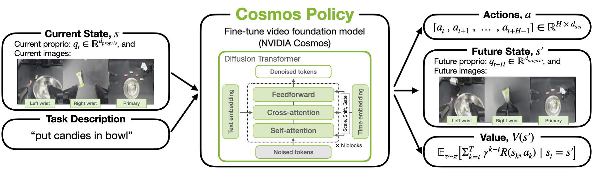

这张总览图是整篇论文的入口。Cosmos Policy 从 NVIDIA Cosmos-Predict2-2B 视频基础模型出发，输入多视角图像、机器人本体状态和语言任务，输出三类东西：

1. 机器人动作块，即未来一段时间的动作序列。
2. 未来状态，包括未来图像观测和未来本体状态。
3. 未来状态的价值，即预期回报。

最重要的是，论文强调它没有修改基础视频模型结构。所有新增模态都通过 latent frame injection 进入同一个 latent diffusion sequence。

## 为什么这篇论文值得看

机器人策略学习里长期有一个张力：视觉语言模型很擅长理解语义，但它们的预训练主要来自静态图像和文本；机器人控制真正需要的，却是时序、接触、物体运动、动作后果这些动态知识。视频生成模型天然训练在“给定当前画面，预测后续画面”的任务上，它们可能更懂物理演化和运动模式。

已有视频机器人方法通常会走两条路：

- 先微调视频模型，再额外训练动作预测模块。
- 从头设计一个统一的视频-动作模型，但无法直接继承大规模预训练视频模型的结构和权重。

Cosmos Policy 的切入点是：既然视频扩散模型本来就能建模复杂高维分布，为什么不能直接让动作也成为它要去扩散生成的一种 latent frame？这让论文从“给视频模型加控制能力”变成了“把控制问题翻译成视频模型原本就会处理的 denoising 问题”。

## 基础模型：Cosmos-Predict2 是什么角色

论文使用的基础模型是 Cosmos-Predict2-2B-Video2World。它是 latent video diffusion model，输入起始图像和文本描述，预测后续视频帧。

它的关键机制可以简化为三步：

1. 用 Wan2.1 时空 VAE tokenizer 把视频压缩成 latent 序列。
2. 给 latent 加不同噪声等级的高斯噪声。
3. 训练 diffusion transformer 在文本条件和噪声等级条件下恢复干净 latent。

原模型的 latent 序列形状大致是：

```text
(1 + T') x H' x W' x 16
```

其中空间分辨率被压缩 8 倍，时间维度后续帧被压缩 4 倍。第一个帧比较特殊，它作为条件帧保持干净，不参与同样的时间压缩。这一点后面会影响 Cosmos Policy 里为什么要插入一个 blank placeholder。

## 核心机制：Latent Frame Injection

论文最关键的图是下面这张。

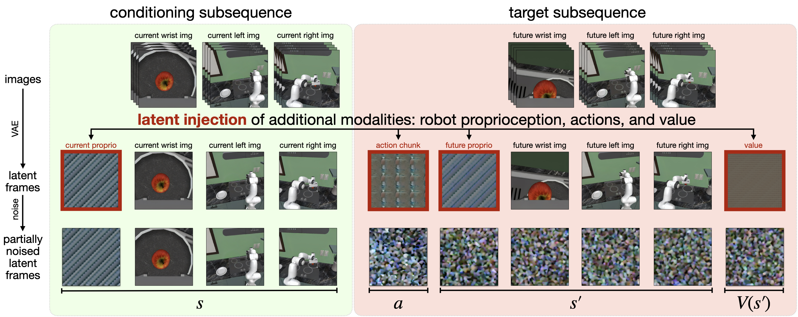

原本视频模型只认识图像 latent。Cosmos Policy 的做法是：在 latent 序列里插入额外位置，让这些位置承载机器人相关信息。

以一个有两个第三人称相机和一个腕部相机的机器人为例，论文构造了 11 个 latent frames：

| 位置 | 含义 |
|---|---|
| 1 | blank placeholder |
| 2 | 当前机器人本体状态，如关节角或末端位姿 |
| 3 | 当前腕部相机图像 |
| 4 | 当前第一第三人称相机图像 |
| 5 | 当前第二第三人称相机图像 |
| 6 | 动作块 |
| 7 | 未来机器人本体状态 |
| 8 | 未来腕部相机图像 |
| 9 | 未来第一第三人称相机图像 |
| 10 | 未来第二第三人称相机图像 |
| 11 | 未来状态价值 |

换成概率建模的视角，这个序列表达的是：

```text
(s, a, s', V(s'))
```

这里的 `s` 是当前观测，`a` 是动作块，`s'` 是执行这个动作块后的未来观测，`V(s')` 是未来状态价值。

### 非图像信息如何塞进 latent frame？

这是一个很有工程味的设计。

动作、本体状态、价值函数本来是低维向量或标量，不是图像。Cosmos Policy 先把它们归一化到 `[-1, +1]`，然后复制填满一个 `H' x W' x C'` 的 latent volume。也就是说，一个动作块会被展平成向量，再重复铺满整个 latent frame。推理时再反过来：对重复拷贝求平均，反归一化得到动作或价值。

这个做法看起来朴素，但好处是极大地减少了结构改造：模型看到的仍然是固定形状的 latent frame 序列，只不过其中某些 frame 的语义从“视频帧”变成了“动作/状态/价值”。

附录图把实现细节画得更清楚：

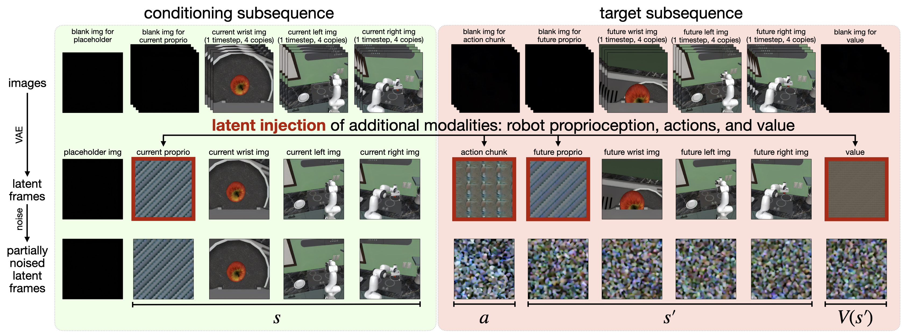

这里有两个细节值得注意：

- blank image 会先进入 VAE tokenizer，随后对应的 latent frame 被非图像模态覆盖。
- 因为视频 tokenizer 的时间压缩方式比较特殊，论文在序列开头放了一个额外 blank placeholder，以保证当前观测和未来观测在 latent 结构上对齐。

## 联合训练：一个模型同时当策略、世界模型和值函数

Cosmos Policy 不只是一个动作预测器。它希望同一个模型同时具备三种能力：

- 策略：`p(a, s', V(s') | s)`
- 世界模型：`p(s', V(s') | s, a)`
- 价值函数：`p(V(s') | s, a, s')`

关键不在于换网络，而在于换 conditioning mask。完整 latent 序列始终是同一套 `(s, a, s', V(s'))`，训练时哪些部分保持干净作为条件，哪些部分加噪作为目标，决定了这一批样本在训练哪个功能。

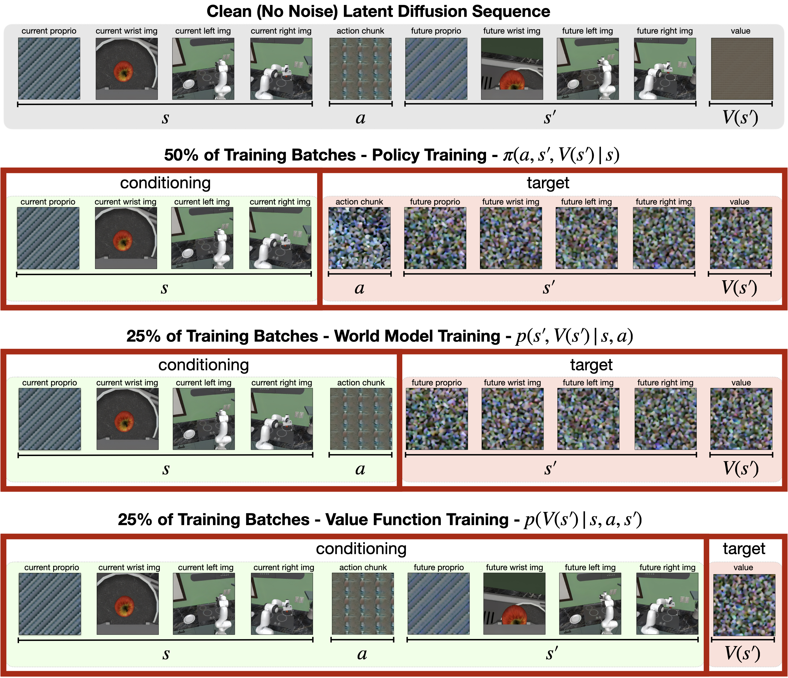

论文的初始训练 batch 分配是：

| 数据/目标 | 占比 | 学什么 |
|---|---:|---|
| demonstration dataset | 50% | 策略，给定 `s` 生成 `a, s', V(s')` |
| rollout dataset 的一半 | 25% | 世界模型，给定 `s, a` 生成 `s', V(s')` |
| rollout dataset 的另一半 | 25% | 价值函数，给定 `s, a, s'` 生成 `V(s')` |

一开始 rollout dataset 可以只是 demonstration dataset 的超集，包括 replay 失败的示范。到后面做规划时，会额外收集真实策略 rollout 来细化世界模型和价值函数。

这里最值得品味的是“辅助监督”。策略并不是只学 `p(a|s)`，而是同时预测动作、未来状态和未来价值。论文实验显示，只让策略预测动作会明显变差。直觉上，这相当于逼迫动作生成器理解“这个动作之后世界会变成什么样”，而不是仅仅拟合示范动作的表面分布。

## 推理：并行生成与自回归生成

Cosmos Policy 支持两种生成方式。

直接策略执行时，它并行生成动作、未来状态和价值；真正执行时只拿动作块，其他输出可以丢掉。这样速度较快。

做 planning 时，它倾向于自回归生成：先生成候选动作，再基于动作生成未来状态，最后评估未来状态价值。这样更慢，但未来状态和值函数预测质量更高，也方便使用单独 fine-tune 后的 planning model。

## 规划：Best-of-N + 世界模型 + 价值函数

论文中的规划不是复杂树搜索，而是单层 best-of-N：

1. 用 policy model 采样多个动作块候选。
2. 用 planning model 预测每个动作块导致的未来状态。
3. 对未来状态做价值估计。
4. 选择预测价值最高的动作块执行。

为了提升稳定性，论文还做了 ensemble：每个动作候选生成 3 个未来状态，每个未来状态生成 5 个价值预测，共 15 个价值估计。聚合时使用 majority mean，即先判断多数预测是成功还是失败，再在多数分组里平均价值，避免少数离群高分或低分主导选择。

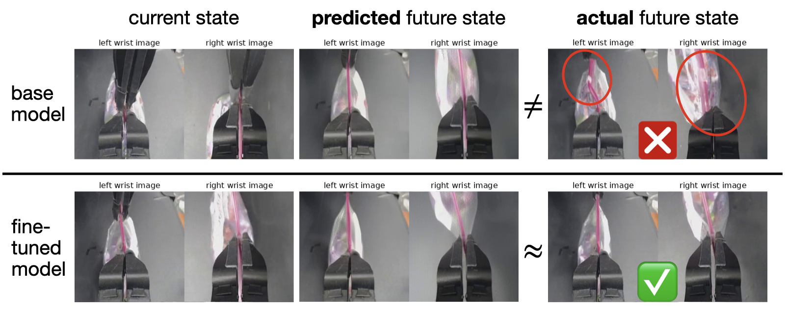

这张图展示了为什么需要 rollout 数据来细化 planning model。只用示范训练的 base model 可能看不到失败分布，因此预测不出“拉链袋滑落”这类错误后果。用真实策略 rollout 继续 fine-tune 后，世界模型更容易预测失败状态，从而在规划时避开坏动作。

## 噪声分布：从视频生成到动作控制的小改动

动作控制比视频生成更怕小误差。论文发现 Cosmos-Predict2 原本的噪声分布更适合视频生成，但不太适合精确动作预测。

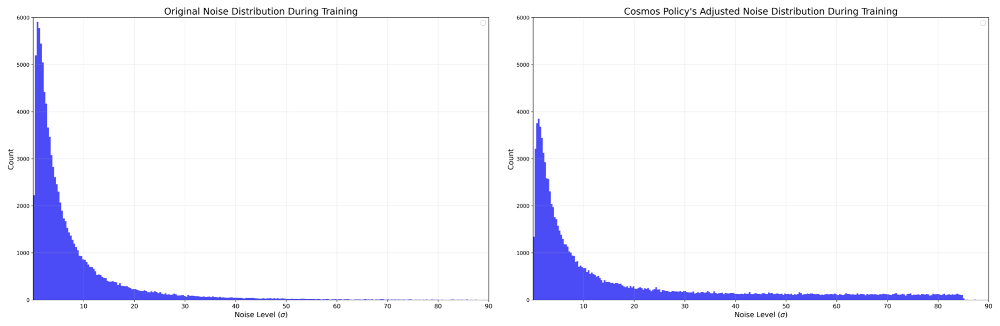

原模型使用类似 EDM 的 log-normal 噪声分布。问题是它在高噪声区域的训练权重不足，而 diffusion sampling 一开始正是从高噪声开始。如果高噪声阶段 denoise 不准，后面的动作预测误差会层层传递。

Cosmos Policy 的调整是：

- 训练时用混合噪声分布：70% 来自原 log-normal，30% 来自 `[1.0, 85.0]` 的 uniform。
- 推理时把最低噪声下界提高到 `sigma_min = 4`，而不是接近 0。

这个细节很重要。它说明把生成模型用于控制，并不是只要“把动作编码进去”就完事了；采样动态也要迁就控制任务对数值精度的要求。

## 实验设置：三个层级的验证

论文在三个环境上验证：

| 环境 | 类型 | 任务特点 |
|---|---|---|
| LIBERO | 仿真，单臂 Franka | 空间、物体、目标、长程任务 |
| RoboCasa | 仿真厨房，单臂 Franka | 24 个厨房操作任务，包含 unseen objects 和 unseen scenes |
| ALOHA | 真实双臂机器人 | 高精度、多模态、长程双臂操作 |

### LIBERO 与 RoboCasa

LIBERO 使用四个 task suites，每个 suite 10 个任务，每个任务 50 条示范。Cosmos Policy 过滤失败示范用于策略训练，但完整数据可用于世界模型和值函数训练。

RoboCasa 更强调数据效率。很多对比方法使用 300 条甚至更多示范，Cosmos Policy 只使用每个任务 50 条人工遥操作示范，最终平均成功率达到 67.1%。

论文报告的关键结果：

| Benchmark | Cosmos Policy |
|---|---:|
| LIBERO 平均成功率 | 98.5% |
| RoboCasa 平均成功率 | 67.1% |

在 LIBERO 上，它超过了 Diffusion Policy、π0、π0.5、OpenVLA-OFT、CogVLA 等强基线。在 RoboCasa 上，它以 50 demos/task 达到 67.1%，略高于若干使用更多数据的模型。

### ALOHA 真实机器人任务

ALOHA 实验更能体现论文想解决的问题：双臂、高精度、长时程、多模态动作分布。

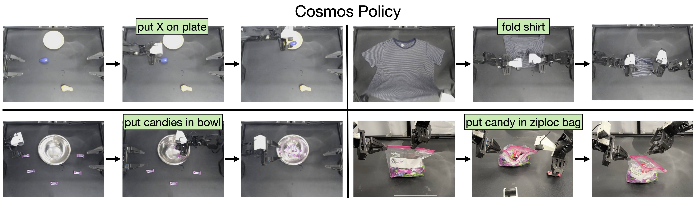

四个任务分别是：

- `put X on plate`：按语言指令把目标物体放到盘子上。
- `fold shirt`：多步折衣服，接触丰富、长时程。
- `put candies in bowl`：把多个糖果抓进碗里，动作选择高度多模态。
- `put candy in ziploc bag`：打开拉链袋并放入糖果，需要毫米级精度。

评估共 101 次 trial，包含 in-distribution 和 OOD 初始条件。

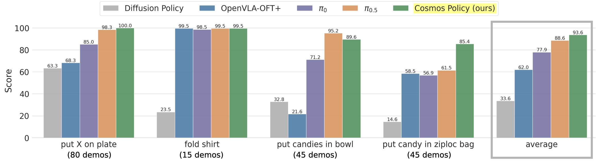

论文报告 Cosmos Policy 在 ALOHA 平均得分 93.6，是所有方法中最高。更有意思的是，它不是每个子场景都压倒性领先：π0.5 在某些 OOD 条件下非常强，但 Cosmos Policy 在整体平均和高精度任务上表现更稳。

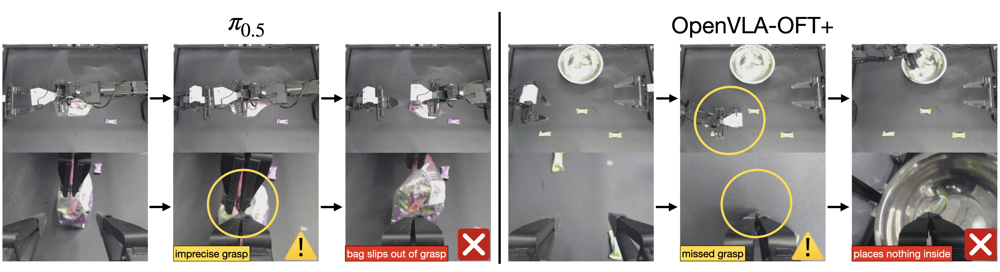

这张图解释了论文对 VLA baseline 的观察：

- π0.5 在 ziploc bag 任务中容易抓不稳拉链袋。
- OpenVLA-OFT+ 在 candies 任务中可能伸向两个糖果之间，像是把多峰动作分布平均掉了。

Cosmos Policy 用 diffusion 生成动作块，天然更适合表示多峰动作分布；同时视频模型预训练提供的动态先验可能帮助它处理接触和运动后果。

## 规划实验：模型式规划优于 Q 值捷径

规划实验聚焦两个最难的 ALOHA 任务：`put candies in bowl` 和 `put candy in ziploc bag`。因为 base Cosmos Policy 在前两个任务已经很高，提升空间不大。

论文收集了 648 条 policy rollouts，其中包括已有 direct policy 评估产生的 505 条，以及额外为 ziploc bag 收集的 143 条。然后 fine-tune 得到 planning model。

它比较了两种规划变体：

- Model-based：先预测 `s'`，再估计 `V(s')`。
- Model-free：直接预测 `Q(s, a)`。

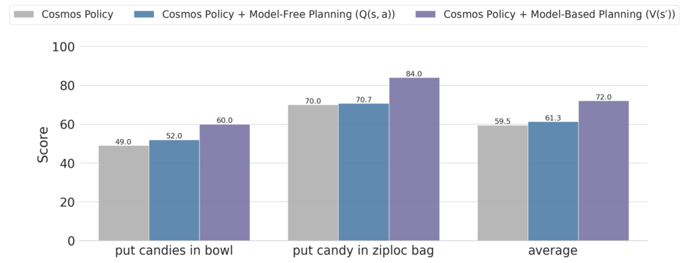

结果显示，model-based 的 `V(s')` 方案最好，在两个挑战任务上平均提升 12.5 分。论文给出的解释也很合理：rollout 数据有限时，直接学高维输入下的 Q 函数更容易过拟合；先让世界模型预测未来状态，再评估状态价值，可能更数据高效，也更符合视频模型的原始能力。

## 消融实验：哪些组件真的重要

论文的消融很有信息量。

### LIBERO 消融

| 方法 | 平均成功率 |
|---|---:|
| Cosmos Policy | 98.5% |
| 去掉辅助损失 | 97.0% |
| 不用预训练，从头训练 | 94.6% |

这说明两个点：

- 让策略同时预测未来状态和价值，不只是为了 planning，也能提升 direct policy。
- 视频预训练确实带来收益，不只是架构本身有效。

### RoboCasa 更细消融

RoboCasa 的消融更狠：一步步移除 value samples、world model samples、policy 的 value auxiliary target、policy 的 future-state auxiliary target。最终只预测动作的 barebones policy 从 67.1% 掉到 44.4%。

这个结果几乎是整篇论文最有说服力的部分之一：Cosmos Policy 的强点不是“用大模型做动作回归”，而是把动作预测绑定到未来状态建模里。未来状态辅助监督可能是视频模型先验被真正激活的地方。

论文还报告了一个速度相关结果：RoboCasa 上只用 1 个 denoising step，成功率仍有 66.4%，而 5 steps 是 67.1%。如果后续工程优化得好，这个方向有实际部署潜力。

## 训练和推理成本

这篇工作非常吃算力。

| 场景 | 训练设置 |
|---|---|
| LIBERO | 64 H100，40K steps，约 48 小时 |
| RoboCasa | 32 H100，45K steps，约 48 小时 |
| ALOHA | 8 H100，50K steps，约 48 小时 |

推理延迟：

| 模式 | 延迟 |
|---|---:|
| LIBERO/RoboCasa direct policy，5 denoising steps | 0.61 秒/action chunk，1 H100 |
| ALOHA direct policy，10 denoising steps | 0.95 秒/action chunk，1 H100 |
| RoboCasa 1 denoising step | 0.16 秒/action chunk，1 H100 |
| ALOHA planning，best-of-8 | 4.9 秒/action chunk，8 H100 |

这里要注意：延迟是每个 action chunk 的生成时间，不是每个控制 tick。ALOHA 中一个 action chunk 覆盖 2 秒执行，因此 direct policy 的 0.95 秒停顿还勉强可用。但 planning 的 4.9 秒明显限制了动态任务。

## 我对方法的理解：它真正新在哪里

Cosmos Policy 的新意不只是“视频模型用于机器人”。更准确地说，它提供了一种低侵入式改造基础生成模型的范式：

```text
不要改模型结构，
改 token/latent 序列的语义；
不要新建动作头，
把动作变成模型原生生成对象；
不要拆 policy/world/value 三个网络，
用 conditioning mask 让同一网络扮演不同角色。
```

这种范式有几个漂亮之处：

1. **保留预训练权重的完整性**  
   不改主干结构，就更容易继承基础视频模型的时空先验。

2. **统一多模态输出**  
   动作、本体状态、图像、价值都在同一个 latent diffusion 目标下训练。

3. **自然支持规划**  
   因为模型本来就会预测 `s'` 和 `V(s')`，best-of-N planning 几乎是顺手长出来的。

4. **动作分布不是单点回归**  
   扩散模型适合多峰分布，这对抓多个糖果、选择不同可行轨迹这类任务非常关键。

## 也要冷静看局限

论文自己也承认了几个限制，我再加一点读者视角。

第一，算力门槛很高。训练几十张 H100，planning 还要 8 张 H100 并行，这不是普通实验室或工业团队能轻松复现的设置。

第二，规划依赖 rollout 数据。只用成功示范训练，模型看不到失败分布，就难以预测坏动作后果。要让 planning 真正有效，必须收集策略自己的失败经验。

第三，规划深度很浅。当前只是单层 best-of-N，不是多步树搜索。它选择的是“这个 action chunk 后状态价值最高”的动作，而不是显式规划多步未来。

第四，非图像模态的 latent injection 很聪明，但也有点“硬塞”。复制低维向量填满 latent volume 不是信息效率最高的编码方式。它胜在简单和兼容，但未来可能有更优雅的连续 token 表示。

第五，动态任务仍然难。4.9 秒 planning 延迟对桌面慢速操作尚可，对移动机器人、避障、动态抓取等场景就很吃力。

## 和 VLA 路线的关系

这篇论文不是简单地说 VLA 不行。更像是在补 VLA 的短板。

VLA 的优势是语义、语言、开放世界概念；视频模型的优势是时序、运动、物理后果。Cosmos Policy 的结果表明，在低层控制和接触密集操作上，视频预训练可能是更合适的初始化。

未来很可能不是二选一，而是融合：

- 用 VLA 做任务理解、语言分解、目标选择。
- 用视频 world model 做动作后果预测。
- 用 diffusion policy 做多峰动作生成。
- 用 value/search 在候选轨迹里选更稳的一条。

Cosmos Policy 可以看作这个方向上的一个强信号：基础模型进入机器人，不一定只能从语言模型入口进来，视频生成模型也许是低层控制的另一条主路。

## 文中其他原图索引

论文还给出了 ALOHA 的 in-distribution 和 OOD 初始条件示例，便于理解评估难度。

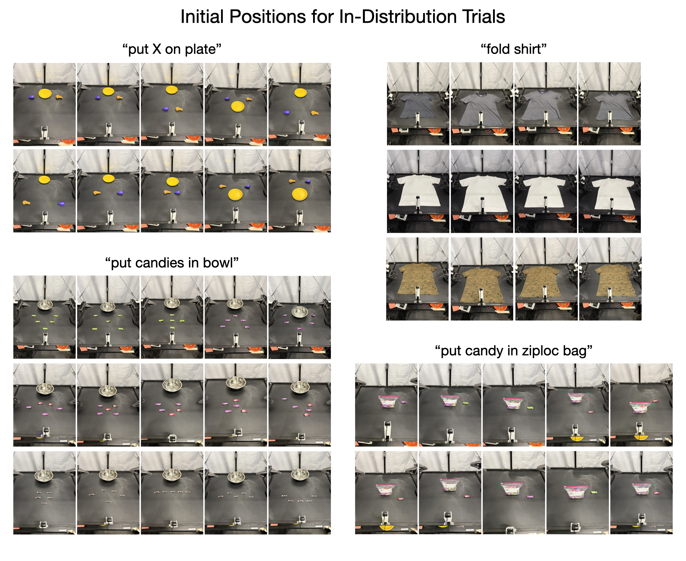

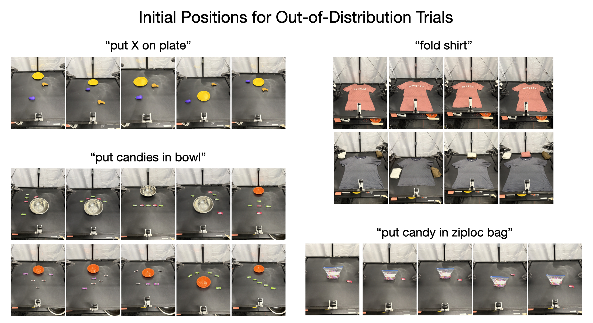

## 总结

Cosmos Policy 这篇论文最值得记住的是 latent frame injection。它把“动作控制”翻译成“视频 diffusion latent 序列里的若干 frame 生成问题”，从而在不修改 Cosmos-Predict2 主干结构的情况下，把一个视频生成模型变成了策略、世界模型和值函数的统一体。

从实验看，它在 LIBERO、RoboCasa 和真实 ALOHA 上都表现很强，尤其是在双臂高精度、多峰动作任务中显示出视频扩散模型的优势。规划部分也说明，未来状态预测不只是辅助训练信号，还能配合 rollout experience 变成实际提升成功率的搜索机制。

我读完后的判断是：这不是一个“轻量可复现”的方法，但它是一个很有方向感的方法。它指向的是一种更统一的机器人基础模型形态：模型不只是看图输出动作，而是同时生成动作、想象未来、评估未来，并用这些能力在测试时做选择。

## 参考资料

- Kim et al., *Cosmos Policy: Fine-Tuning Video Models for Visuomotor Control and Planning*, arXiv:2601.16163, 2026.
- NVIDIA Research project page: [https://research.nvidia.com/labs/dir/cosmos-policy/](https://research.nvidia.com/labs/dir/cosmos-policy/)
- arXiv abstract page: [https://arxiv.org/abs/2601.16163](https://arxiv.org/abs/2601.16163)
